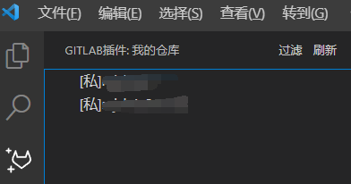
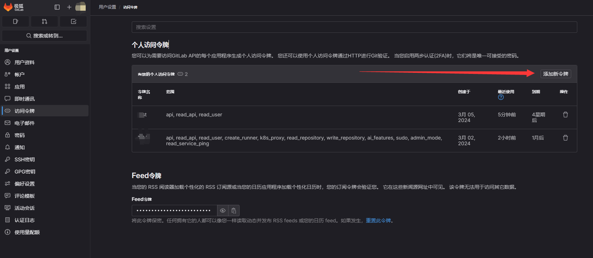
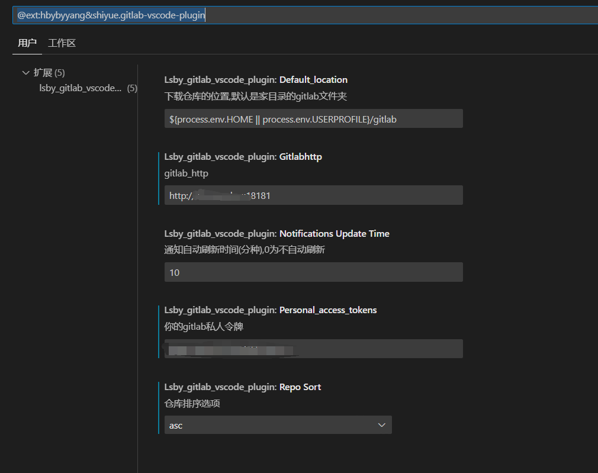

# Gitlab常用功能
该项目是gitee_vscode_plugin的修改版本，改成可用gitlab运行

[GitHub 项目地址](https://github.com/OctoberShiyue/gitee_vscode_plugin)
[VSCode 商店地址](https://marketplace.visualstudio.com/items?itemName=hbybyyang.gitee-vscode-plugin)

[原Gitee 项目地址](https://gitee.com/hbybyyang/gitee_vscode_plugin)
[原VSCode 商店地址](https://marketplace.visualstudio.com/items?itemName=hbybyyang.gitee-vscode-plugin)

快捷操作。包括下载、显示现有仓库、在 VS Code 或资源管理器中打开等等。

## 效果

## 使用说明

1.添加一个`私人令牌`

2.添加令牌设置

3.重启 VS Code

## 其他

- 欢迎意见和建议
- 欢迎pr

## 相关

[g8up/vscode-gitee](https://gitee.com/g8up/vscode-gitee)
